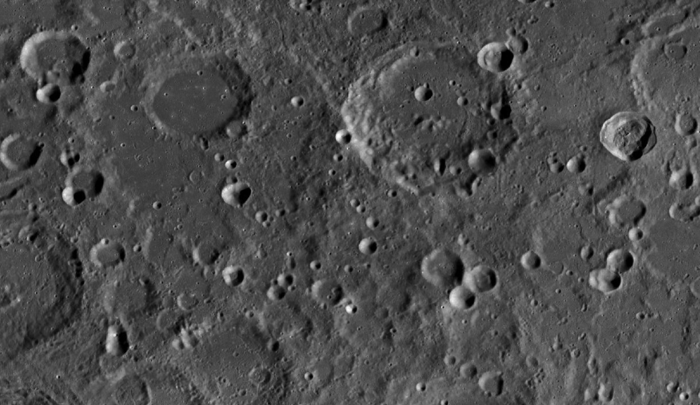
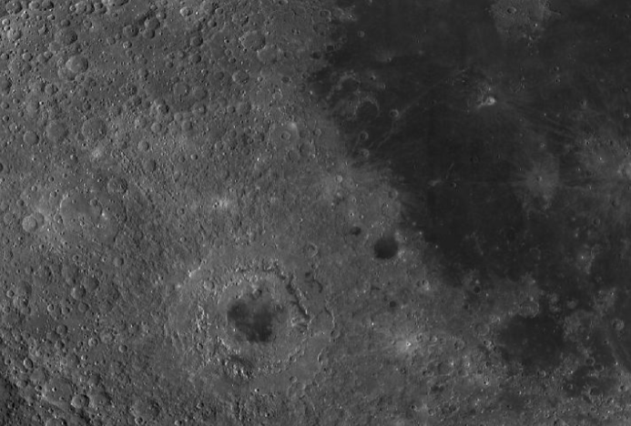

# Interactive Simulation Hub

Interactive Simulation Hub, etkileşimli simülasyonlar, 3D görselleştirme, rota planlama, görev kontrol arayüzleri ve destekleyici backend katmanlarını tek bir `pnpm workspace` altında toplayan bir monorepo yapısıdır.

Bu repo içindeki ana proje, Ay yüzeyinde görev yapan bir rover'ı simüle eden `moon-rover` uygulamasıdır. Uygulama; rota üretimi, çevresel risk değerlendirmesi, waypoint tabanlı görev akışı, kamera ve sahne yönetimi gibi konuları tek bir arayüzde birleştirir.



## İçindekiler

- [Proje Özeti](#proje-özeti)
- [Neden Bu Proje?](#neden-bu-proje)
- [Öne Çıkan Özellikler](#öne-çıkan-özellikler)
- [Teknoloji Yığını](#teknoloji-yığını)
- [Monorepo Yapısı](#monorepo-yapısı)
- [Moon Rover Modülleri](#moon-rover-modülleri)
- [Kurulum](#kurulum)
- [Çalıştırma Komutları](#çalıştırma-komutları)
- [Geliştirme Akışı](#geliştirme-akışı)
- [Gelecek Geliştirmeler](#gelecek-geliştirmeler)
- [Lisans](#lisans)

## Proje Özeti

Bu repo, tek bir uygulamadan ibaret değildir. Amaç; simülasyon tarafını, API tarafını, ortak tipleri, veri şemalarını ve yardımcı scriptleri aynı geliştirme çatısı altında yönetmektir. Böylece hem frontend hem backend katmanları arasında daha tutarlı bir geliştirme süreci kurulabilir.

Özellikle `moon-rover` tarafı, şu başlıkları bir araya getirir:

- 3D ortamda rover hareketi
- Prosedürel arazi oluşturma
- Waypoint tabanlı rota planlama
- Risk, eğim ve aydınlatma gibi yüzey analizleri
- Kontrol paneli odaklı görev yönetimi
- Gelecekte genişletilebilir görev/sensör simülasyonları

## Neden Bu Proje?

Bu proje, sadece bir görsel demo değil; aynı zamanda aşağıdaki alanların birleşimini gösteren teknik bir çalışma niteliği taşır:

- gerçek zamanlı 3D arayüz geliştirme
- simülasyon mantığı ve hareket kontrolü
- veri odaklı görselleştirme
- çok paketli monorepo organizasyonu
- ortak API ve tip üretim akışı

Bir başka deyişle bu repo, hem ürünleşebilecek bir arayüz prototipi hem de güçlü bir teknik portföy projesi olarak değerlendirilebilir.

## Öne Çıkan Özellikler

### Moon Rover Simülasyonu

- React, Vite ve Three.js tabanlı etkileşimli 3D sahne
- React Three Fiber ile gerçek zamanlı render altyapısı
- Detaylı rover modeli ve hareket kontrolü
- Ay yüzeyi benzeri prosedürel terrain üretimi
- Waypoint seçimi ve rota planlama akışı
- Sağ panel üzerinden görev yönetimi ve mini-map etkileşimi
- Kamera modu ve sahne gözlemi

### Analiz ve Planlama

- eğim tabanlı değerlendirme
- hazard/risk yaklaşımı
- aydınlatma etkisini hesaba katan planlama mantığı
- alternatif rota modları üzerinden karar desteği
- görev sırasında görselleştirilmiş analiz çıktıları

### Monorepo Avantajları

- frontend, backend ve ortak kütüphanelerin tek repoda toplanması
- yeniden kullanılabilir API istemcileri
- OpenAPI tanımından üretilebilen tip ve şema katmanı
- ölçeklenebilir paket yapısı

## Teknoloji Yığını

Bu repoda kullanılan temel araçlar ve kütüphaneler:

- Node.js
- pnpm workspaces
- TypeScript
- React
- Vite
- Three.js
- React Three Fiber
- Express 5
- Drizzle ORM
- Zod
- OpenAPI / Orval

## Monorepo Yapısı

```text
Interactive-Simulation-Hub/
├── artifacts/
│   ├── api-server/         # Express tabanlı API sunucusu
│   ├── mockup-sandbox/     # UI / mockup denemeleri
│   └── moon-rover/         # 3D Moon Rover simülasyonu
├── attached_assets/        # Görseller, veri dosyaları, yardımcı içerikler
├── lib/
│   ├── api-client-react/   # Üretilmiş API istemci katmanı
│   ├── api-spec/           # OpenAPI tanımı ve codegen ayarları
│   └── api-zod/            # Zod şema üretimi
├── db/                     # Drizzle yapılandırması ve veri katmanı
├── scripts/                # Yardımcı scriptler ve araçlar
├── package.json
├── pnpm-lock.yaml
└── pnpm-workspace.yaml
```

## Moon Rover Modülleri

`artifacts/moon-rover` bu reponun merkezinde yer alır. Aşağıdaki ana parçalardan oluşur:

### 1. Uygulama Orkestrasyonu

Ana akış `src/App.jsx` içinde yönetilir.

Burada genel olarak:

- rover state yönetimi
- waypoint akışı
- rota planlama tetikleme
- görev logları
- toast bildirimleri
- kamera davranışları
- dust hazard ve görev durumu gibi ek simülasyon mantıkları

yürütülür.

### 2. 3D Sahne Katmanı

`src/components/MoonScene.jsx`, React Three Fiber tabanlı sahne bileşenidir.

Bu bölümde:

- terrain mesh oluşturma
- rover render işlemleri
- rota çizimleri
- güneş/aydınlatma etkisi
- tekerlek izleri
- toz efektleri
- sahne içi yardımcı nesneler

yer alır.

### 3. Görev Kontrol Paneli

`src/components/RightPanel.jsx`, kullanıcı etkileşiminin önemli bir bölümünü taşır.

Panel üzerinden:

- mini-map etkileşimi
- waypoint yerleştirme
- rota modu seçimi
- heatmap görüntüleme
- görev kontrolü
- durum ve analiz görünümü

yapılır.

### 4. Pathfinder

`src/utils/pathfinder.js`, rota üretimi için temel planlama katmanıdır.

Burada:

- world/grid dönüşümleri
- maliyet haritaları
- engel ve krater etkileri
- aydınlatma etkisi
- A* tabanlı arama mantığı

gibi hesaplamalar bulunur.

### 5. Arazi ve Görselleştirme Yardımcıları

Repo içinde terrain üretimi, heatmap üretimi, öğrenme modeli ve yardımcı görselleştirme fonksiyonları ayrı modüller halinde düzenlenmiştir. Bu yapı yeni sensör katmanları, yeni görev türleri veya farklı simülasyon modları eklemeyi kolaylaştırır.

## Ek Görsel

Aşağıdaki görsel, projenin tematik yönünü ve lunar yüzey estetiğini destekleyen repodaki görsel kaynaklardan biridir:



## Kurulum

Projeyi yerel ortamda çalıştırmak için önce bağımlılıkları yükleyin:

```bash
pnpm install
```

Not:

- Repo, `pnpm` ile kullanılacak şekilde yapılandırılmıştır.
- Kök `package.json` içinde farklı paket yöneticilerini engelleyen bir kontrol bulunur.

## Çalıştırma Komutları

### Moon Rover geliştirme sunucusu

```bash
pnpm --filter moon-rover dev
```

### Moon Rover production build

```bash
pnpm --filter moon-rover build
```

### Workspace genel typecheck

```bash
pnpm run typecheck
```

### Workspace genel build

```bash
pnpm run build
```

## Geliştirme Akışı

Bu repo ile çalışırken önerilen akış:

1. `pnpm install` ile bağımlılıkları yükle.
2. `pnpm --filter moon-rover dev` ile ana uygulamayı ayağa kaldır.
3. Simülasyon mantığı için `artifacts/moon-rover/src` altındaki bileşenleri geliştir.
4. API tarafı gerekiyorsa `artifacts/api-server` ve `lib` altındaki paketleri güncelle.
5. Değişiklikleri doğrulamak için `pnpm run typecheck` ve ilgili build komutlarını çalıştır.

## Bu Repo Ne İçin Uygun?

Bu proje özellikle şu amaçlar için güçlü bir temel sunar:

- portföy projesi olarak sunum
- araştırma / prototip amaçlı rover simülasyonu
- interaktif 3D dashboard geliştirme
- görev planlama arayüzleri tasarlama
- monorepo mimarisi ile çok paketli frontend/backend geliştirme

## Gelecek Geliştirmeler

Projede ileride geliştirilebilecek alanlar:

- daha gelişmiş görev senaryoları
- rover sensör paketleri
- veri kaydı ve replay sistemi
- çoklu görev ve çoklu araç desteği
- backend ile gerçek zamanlı senkronizasyon
- daha detaylı fizik ve yüzey etkileşimleri

## Lisans

Bu proje `MIT` lisansı ile işaretlenmiştir.
